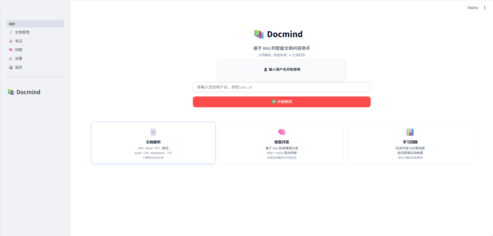
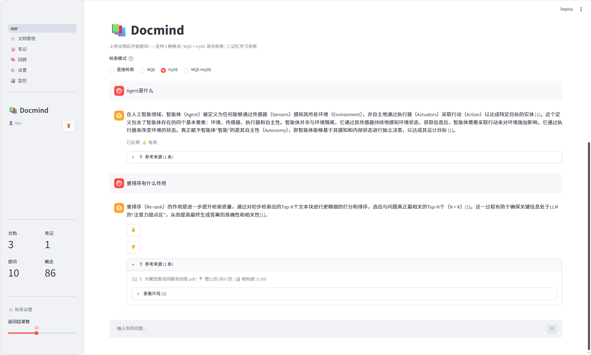
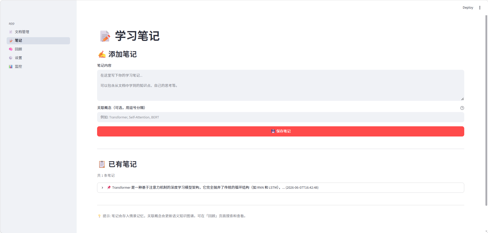
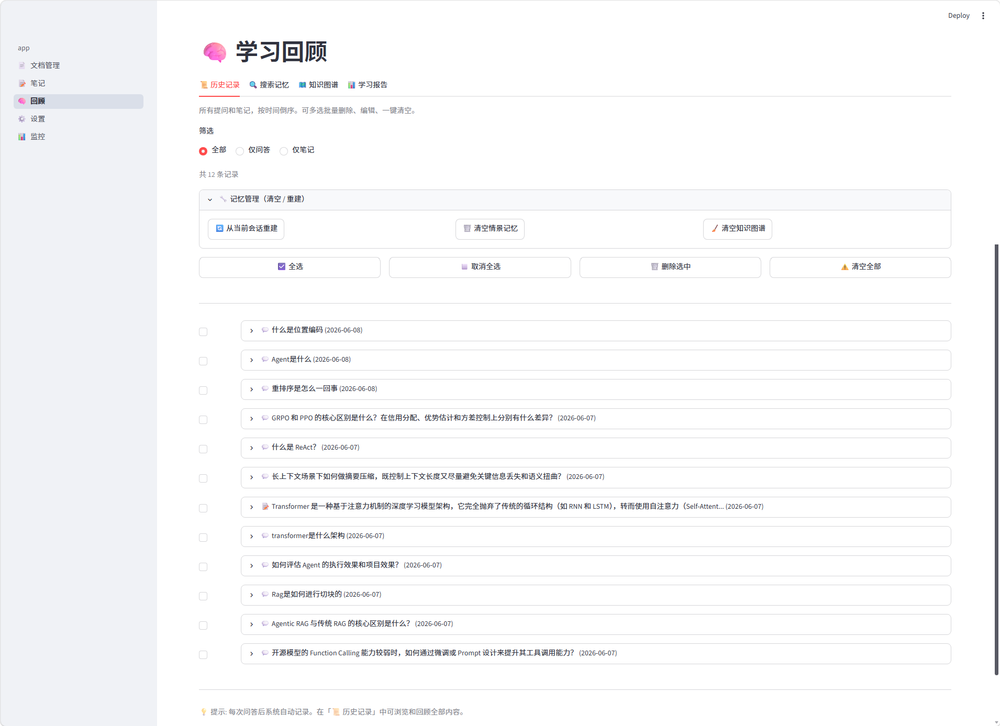
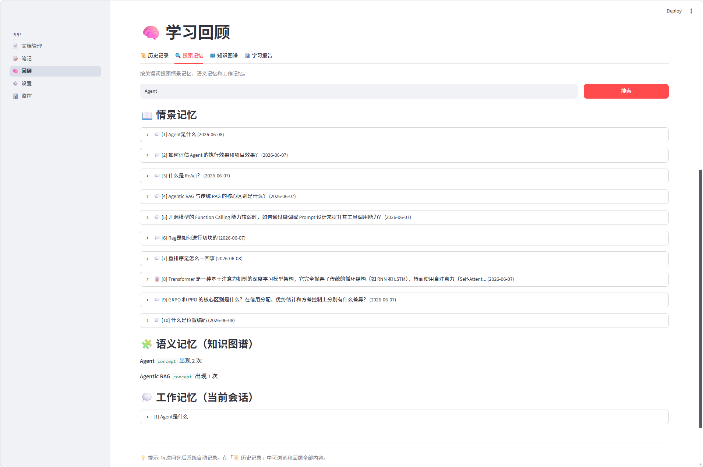
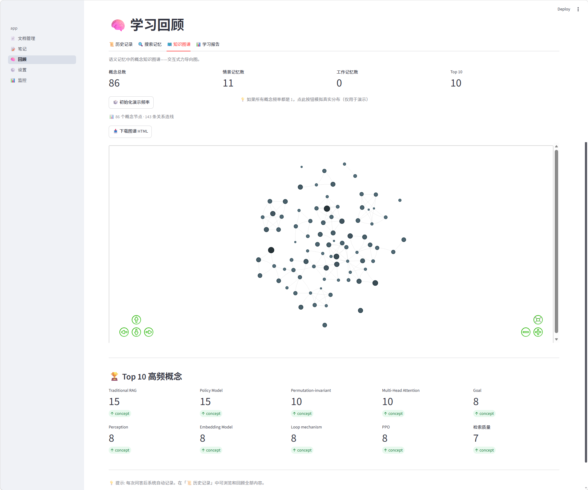
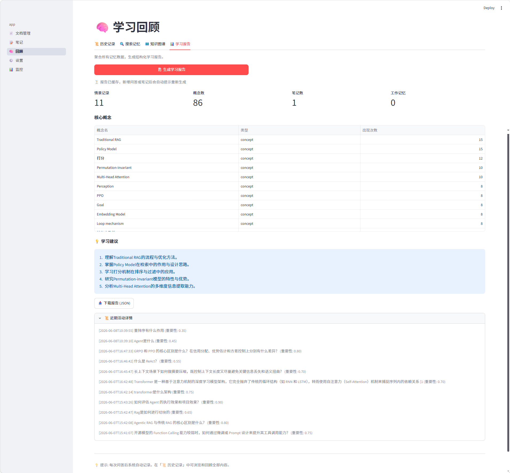
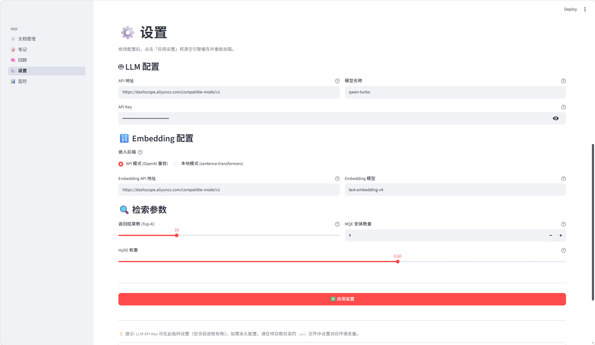
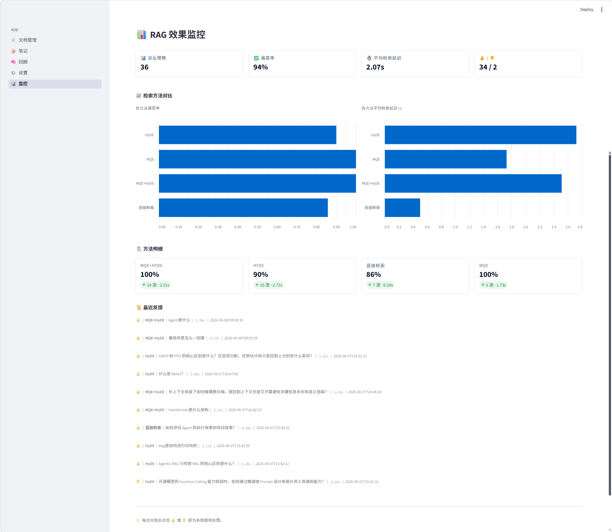

# 📚 DocMind — 智能文档问答助手

Docmind 是一个基于检索增强生成（RAG）的智能文档问答系统。用户上传 PDF、Word、网页等文档后，可以用自然语言提问，系统会自动检索相关片段并生成带内联引用的流式回答，同时将问答记录写入认知记忆模型，逐步构建个人知识图谱。

相比只输出一段文本的 LLM Demo，这个项目更强调完整链路落地：从**多格式文档解析、多维检索策略、答案生成与引用定位，到三记忆学习系统、在线反馈监控与多用户数据隔离**，尽量把 RAG 能力组织成一个可交互、可持久化、可评估的产品原型。

🌐 **在线体验**：https://docmind-production-ed1a.up.railway.app

---

## 📸 效果展示

### 欢迎与问答


> 路径：`assets/showcase/01欢迎界面.png`


> 路径：`assets/showcase/02提问界面.png`

### 文档管理

.png)
> 路径：`assets/showcase/03文档管理界面(网页抓取).png`

.png)
> 路径：`assets/showcase/03文档管理界面(文件上传).png`

### 学习笔记与回顾


> 路径：`assets/showcase/04学习笔记界面.png`


> 路径：`assets/showcase/05历史记录界面.png`


> 路径：`assets/showcase/06搜索记忆界面.png`


> 路径：`assets/showcase/07知识图谱界面.png`


> 路径：`assets/showcase/08学习报告界面.png`

### 设置与监控


> 路径：`assets/showcase/09设置界面.png`


> 路径：`assets/showcase/10监控界面.png`

> 💡 更多内容（包括交互式知识图谱 HTML 文件）请直接查看 `assets/showcase` 文件夹。

---

## ✨ 功能列表

### 文档管理
| 功能 | 说明 |
|------|------|
| 📥 8 种格式 | PDF / Word(.docx) / Markdown(.md) / TXT / PPT(.pptx) / CSV / Excel(.xlsx) / 网页 URL |
| 🌐 网页抓取 | Trafilatura 首选 + BeautifulSoup 回退，自动过滤导航/广告 |
| ✂️ 语义分块 | 1024 tokens / 128 overlap，可配置 |
| 📋 文档管理 | 按格式筛选、查看详情、删除（同步清理向量和元数据） |

### 智能问答
| 功能 | 说明 |
|------|------|
| 🔍 4 种检索策略 | Direct / MQE（RRF k=60）/ HyDE / MQE+HyDE（asyncio.gather 并行） |
| 💬 流式回答 | `st.write_stream` 逐字渲染 |
| 📎 内联引用 | `[1][2]` 标记 + 可展开源片段（适配 8 种格式的位置描述） |
| 👍 用户反馈 | 每条回答下 👍/👎 按钮，记录到 SQLite |

### 三记忆学习系统
| 记忆 | 存储 | 说明 |
|------|------|------|
| 💭 工作记忆 | `st.session_state` | 最近 10 轮对话上下文 |
| 📖 情景记忆 | ChromaDB | Q&A + 笔记持久化，支持语义搜索和时间查询 |
| 🧩 语义记忆 | Neo4j | Concept 节点 + RELATES_TO 边，自动构建知识图谱 |

每次问答后自动：LLM 提取 3-8 个概念 → 情景记忆记录 → Neo4j MERGE 节点 → 概念间建立弱关系。

### 学习回顾
| 功能 | 说明 |
|------|------|
| 📜 历史记录 | 全部 Q&A + 笔记按时间浏览，点击展开完整内容 |
| 🔍 搜索记忆 | 跨情景/语义/工作记忆联合搜索 |
| ✏️ 编辑/删除 | 单条编辑问题和回答、批量多选删除（二次确认）、一键清空全部 |
| 🗺️ 知识图谱 | 概念总数、高频概念 Top10 |
| 📊 学习报告 | JSON 报告 + LLM 学习建议 + 下载 |

### 笔记管理
| 功能 | 说明 |
|------|------|
| 📝 添加笔记 | 文本内容 + 关联概念（逗号分隔） |
| 📋 笔记列表 | 按时间展示完整内容，单条删除 |

### RAG 效果监控
| 功能 | 说明 |
|------|------|
| 📊 满意率 | 总反馈数、满意率、👍/👎 计数 |
| 📈 各方法对比 | 按检索策略的满意率柱状图 + 平均检索延迟对比 |
| ⏱️ 延迟采集 | 每次检索自动计时，按方法聚合 |
| 📜 最近反馈 | 最近 10 条反馈记录 |

### 多用户数据隔离
| 功能 | 说明 |
|------|------|
| 👤 强制初始化 | 首次访问必须输入用户名才能使用 |
| 🔒 6 层隔离 | ChromaDB where / SQLite user_id / Neo4j user_id / 情景记忆过滤 / 分块标签 / 摄入标签 |
| 🔄 刷新保持登录 | `st.query_params` 持久化，所有页面刷新不丢失 |
| 💾 聊天持久化 | SQLite 存储，刷新/切换页面消息不丢 |

### 离线评测框架
| 功能 | 说明 |
|------|------|
| 📝 Ground Truth 生成 | 采样分块 → LLM 生成问题 → 二次改写制造语义鸿沟 → 扩展相邻分块 |
| 📊 评测指标 | Recall@5/10、Precision@5/10、MRR、NDCG@10、P50/P95 延迟 |
| 📋 CLI 报告 | 4 方法对比表格 + JSON 输出 |

### 系统特性
| 特性 | 说明 |
|------|------|
| 🆓 免费模型 | 默认阿里 DashScope（qwen-max），注册即送免费额度 |
| 🎛️ 灵活配置 | 可视化设置页——LLM/Embedding/检索参数，改完即时生效 |
| 🛡️ 优雅降级 | Neo4j 不可用 → 语义记忆自动禁用，问答笔记不影响 |
| 🐍 纯 Python | 0 行 HTML/CSS/JS，Streamlit 原生组件 |

---

## 🏗️ 技术栈

| 组件 | 选型 |
|------|------|
| Web 框架 | **Streamlit**（多页面自动注册，零前端代码） |
| 文档加载/分块 | **LlamaIndex** Reader + SentenceSplitter（仅此环节，其余自实现） |
| 向量数据库 | **ChromaDB** 嵌入式模式（`PersistentClient`，本地持久化） |
| 图数据库 | **Neo4j**（语义记忆知识图谱） |
| 元数据存储 | **SQLite**（文档列表、反馈记录、会话统计、对话持久化） |
| LLM SDK | **OpenAI Python SDK**（兼容 OpenAI / DeepSeek / 智谱 / DashScope / Ollama 等） |
| 嵌入模型 | API 模式（text-embedding-v4）+ 本地模式（sentence-transformers） |
| Python | 3.10+（完整类型注解） |

---

## 📐 系统架构

```
┌──────────────────────────────────────────────────────────┐
│                    Streamlit 应用                         │
│  app.py（问答主页） + pages/（5 个子页面）                  │
│              st.session_state（跨页面共享引擎实例）          │
└──────────────────────────┬───────────────────────────────┘
                           │
┌──────────────────────────▼───────────────────────────────┐
│                   QAEngine（编排层）                       │
│  IngestPipeline │ QueryPipeline(4种检索器) │ MemoryManager │
└──────────────────────────┬───────────────────────────────┘
                           │
┌──────────────────────────▼───────────────────────────────┐
│                    核心服务层                              │
│  LLMClient │ Embedder │ VectorStore(ChromaDB) │ GraphStore │
│  TextChunker │ MultiFormatLoader │ MetadataStore(SQLite)  │
└──────────────────────────┬───────────────────────────────┘
                           │
┌──────────────────────────▼───────────────────────────────┐
│ ChromaDB(嵌入式) │ Neo4j(图) │ LLM API(OpenAI兼容) │ SQLite │
└──────────────────────────────────────────────────────────┘
```

### 检索策略流程

```
原问题 ─┬→ LLM生成4个变体 → 5路并行检索 → RRF(k=60) ─┐
        │                                              ├→ 加权合并(0.4/0.6) → top-10
        └→ LLM生成假设文档 → embed → 检索 ─────────────┘

        asyncio.gather: 两个 LLM 调用并行，互不依赖
```

---

## 🚀 快速启动

### 1. 环境准备

```bash
cd DocMind
python -m venv venv

# Windows:
venv\Scripts\activate
# macOS/Linux:
source venv/bin/activate

pip install -r requirements.txt
```

### 2. 配置

```bash
cp .env.example .env
```

编辑 `.env`，至少填入 `LLM_API_KEY`（默认使用阿里 DashScope，注册地址 [dashscope.aliyun.com](https://dashscope.aliyun.com)）。

### 3. 启动 Neo4j（可选）

```bash
# Docker 一键启动（请将 password 替换为强密码）
docker run -d -p 7474:7474 -p 7687:7687 -e NEO4J_AUTH=neo4j/password neo4j:latest

# 之后开机只需启动已有容器
docker start <容器名>
```

> ⚠️ **安全提示**：上方的 `password` 仅适用于本机开发。如果部署到服务器或公网环境，请务必更换为强密码，并同步修改 `.env` 中的 `NEO4J_PASSWORD`。开源项目的默认密码是公开可见的，直接用有安全风险。

> 不启动 Neo4j 时语义记忆自动降级禁用，问答、笔记等核心功能不受影响。

### 4. 运行

```bash
python run.py
# 或
streamlit run app.py --server.address 0.0.0.0 --server.port 7860
```

浏览器打开 **http://localhost:7860**

### 5. 使用流程

1. 输入用户名 → 进入主界面
2. 打开 **📄 文档管理** → 上传文档或抓取网页
3. 回到 **首页** → 选择检索模式 → 提问
4. 点击 👍/👎 给出反馈
5. 在 **📝 笔记** 页记录心得
6. 在 **🧠 回顾** 页浏览历史、搜索记忆、生成学习报告
7. 在 **📊 监控** 页查看满意率和延迟对比
8. 在 **⚙️ 设置** 页调整参数

---

## 🐳 Docker 部署

不想手动配置 Python 环境？一键启动：

```bash
# 全栈启动（Streamlit + Neo4j 知识图谱）
docker-compose up -d

# 或仅启动应用（不需要 Neo4j）
docker-compose up -d docmind
```

浏览器打开 **http://localhost:7860**

### 首次部署步骤

```bash
# 1. 克隆项目
git clone https://github.com/<your-username>/docmind.git
cd docmind

# 2. 配置环境变量（至少填入 LLM_API_KEY）
cp .env.example .env
# 编辑 .env，填入你的 API Key

# 3. 一键启动
docker-compose up -d
```

### 纯 Docker 运行（不用 docker-compose）

```bash
docker build -t docmind .
docker run -p 7860:7860 --env-file .env -v ./data:/app/data docmind
```

> 📦 **数据持久化**：ChromaDB 向量库、SQLite 提问记录、上传的文档都保存在 `./data` 目录，通过 Docker volume 挂载，容器删除后数据不丢失。

> 💡 **优雅降级**：Neo4j 服务不可用时，知识图谱功能自动禁用，问答、笔记等核心功能完全不受影响。如果你不需要知识图谱，可以在 `docker-compose.yml` 中注释掉 `neo4j` 服务块。

---

## ☁️ Railway 云端部署

项目已部署到 Railway，可直接访问体验，**无需配置任何 API Key**。

### 为什么选 Railway？

- ✅ **原生 Docker 支持**：自动识别 `Dockerfile`，零额外配置
- ✅ **持久化存储**：Volume 挂载 `/app/data`，ChromaDB + SQLite 数据重启不丢
- ✅ **自动 HTTPS**：获得 `*.up.railway.app` 域名

> 💡 部署时只需在 Railway Variables 中配置好 API Key，访问者打开链接即可直接使用，无需任何配置。

---

## 📁 项目结构

```
DocMind/
├── app.py                           # Streamlit 主页（问答）
├── run.py                           # 启动入口
├── pages/                           # 5 个 Streamlit 子页面
│   ├── 1_📄_文档管理.py
│   ├── 2_📝_笔记.py
│   ├── 3_🧠_回顾.py
│   ├── 4_⚙️_设置.py
│   └── 5_📊_监控.py                 # RAG 效果监控
│
├── src/
│   ├── core/                        # 基础设施层（7 文件）
│   │   ├── config.py                # 环境变量 + 全局配置单例
│   │   ├── llm_client.py            # OpenAI 兼容客户端 + 概念提取
│   │   ├── embedder.py              # API / 本地双后端嵌入
│   │   ├── vector_store.py          # ChromaDB PersistentClient 封装
│   │   ├── graph_store.py           # Neo4j 驱动封装
│   │   ├── chunker.py               # LlamaIndex SentenceSplitter
│   │   └── metadata_store.py        # SQLite CRUD（文档/会话/反馈/对话）
│   │
│   ├── ingestion/                   # 多格式加载（11 文件）
│   │   ├── document_loader.py       # 分发器模式
│   │   ├── ingest_pipeline.py       # 加载→分块→嵌入→入库
│   │   └── parsers/                 # 8 个 Parser（PDF/Web/Docx/MD/TXT/PPT/CSV/XLSX）
│   │
│   ├── retrieval/                   # 检索策略（6 文件）
│   │   ├── direct_retriever.py      # 直接向量检索
│   │   ├── mqe_retriever.py         # MQE + RRF 融合
│   │   ├── hyde_retriever.py        # HyDE 假设文档嵌入
│   │   ├── combined_retriever.py    # MQE+HyDE 并行组合
│   │   └── fusion.py                # RRF / 加权合并 / 去重
│   │
│   ├── generation/                  # 答案生成（3 文件）
│   │   ├── prompt_templates.py      # 所有 Prompt 集中管理
│   │   ├── answer_generator.py      # 同步 + 流式生成器
│   │   └── citation_formatter.py    # 引用解析 + 位置描述（8 格式适配）
│   │
│   ├── memory/                      # 三记忆系统（5 文件）
│   │   ├── working_memory.py        # 工作记忆（会话内存，FIFO 淘汰）
│   │   ├── episodic_memory.py       # 情景记忆（ChromaDB 持久化）
│   │   ├── semantic_memory.py       # 语义记忆（Neo4j 知识图谱）
│   │   ├── memory_manager.py        # 三记忆编排器
│   │   └── models.py                # 记忆数据模型
│   │
│   ├── engine/                      # 应用编排（3 文件）
│   │   ├── qa_engine.py             # 主引擎——统一对外接口
│   │   ├── session.py               # Streamlit 引擎单例工厂
│   │   └── models.py                # DTO 定义
│   │
│   └── evaluation/                  # 离线评测框架（5 文件）
│       ├── ground_truth_generator.py # LLM 自动生成评测集
│       ├── evaluation_runner.py      # 4 方法 Benchmark
│       ├── instrumentation.py        # 计时包装器
│       ├── metrics.py                # Recall/MRR/NDCG 等指标
│       └── models.py                 # 评测数据模型
│
├── scripts/                         # CLI 工具
│   ├── generate_eval_dataset.py     # 生成 Ground Truth
│   └── run_evaluation.py            # 跑 Benchmark
│
├── tests/                           # 测试（含 e2e）
├── data/                            # 运行时数据（gitignore）
│   ├── chroma/                      # ChromaDB 持久化
│   ├── evaluation/                  # 评测结果输出
│   └── metadata.db                  # SQLite
├── .env.example
├── requirements.txt
├── CHANGELOG.md
└── README.md
```

---

## 🔑 关键设计决策

| 决策 | 说明 |
|------|------|
| **分发器模式** | 8 个 Parser 统一 `BaseParser` 接口，下游管线格式无关 |
| **RRF 融合** | k=60（Cormack 2009），不依赖跨查询分数归一化 |
| **asyncio.gather 并行** | MQE + HyDE 两个 LLM 调用同时发出，延迟 ≈ max(分支) |
| **逗号分隔概念提取** | 不依赖 JSON，通用兼容所有模型，三级回退解析 |
| **Streamlit 原生** | 0 行 HTML/CSS/JS |
| **优雅降级** | Neo4j 不可用 → 语义记忆自动禁用，核心功能不受影响 |
| **配置单例** | `load_config()` + `st.cache_resource`，全应用配置一致 |
| **6 层用户隔离** | ChromaDB / SQLite / Neo4j / 情景记忆 / 分块 / 摄入，全链路 user_id 过滤 |
| **query_params 持久化** | 刷新/切换页面保持登录，退出即清除 |
| **反馈闭环** | 用户 👍/👎 存入 SQLite `feedback` 表，监控页按方法统计满意率和延迟，形成持续优化回路 |

## 📊 评测

```bash
# 生成评测集（从已入库文档采样 + LLM 生成问题）
python scripts/generate_eval_dataset.py --num 30 --rewrite --expand-gt

# 跑 4 方法 Benchmark
python scripts/run_evaluation.py --dataset data/evaluation/dataset_xxx.json

# 运行单元测试
pytest tests/ -v
```

## ⚙️ 环境变量参考

详见 [`.env.example`](.env.example)，关键变量：

| 变量 | 说明 | 默认值 |
|------|------|--------|
| `LLM_API_KEY` | LLM API 密钥（**必填**） | - |
| `LLM_BASE_URL` | API 基础地址 | `https://dashscope.aliyuncs.com/compatible-mode/v1` |
| `LLM_MODEL` | 模型名称 | `qwen-max`（免费额度） |
| `EMBEDDING_BACKEND` | `api` 或 `local` | `api` |
| `EMBEDDING_MODEL` | 嵌入模型 | `text-embedding-v4` |
| `EMBEDDING_BATCH_SIZE` | 嵌入批大小（DashScope 上限 10） | `10` |
| `NEO4J_URI` | Neo4j 地址 | `bolt://localhost:7687` |
| `HYDE_WEIGHT` | HyDE 分支权重 | `0.6` |

---

## 📄 支持的 LLM 后端

通过 OpenAI 兼容 SDK，改 `.env` 三行即可切换：

| 平台 | LLM 模型 | 嵌入模型 | 费用 |
|------|---------|---------|------|
| **阿里 DashScope** | `qwen-max` | `text-embedding-v4` | 有免费额度 |
| **硅基流动** | `Qwen/Qwen2.5-7B-Instruct` | `BAAI/bge-large-zh-v1.5` | 有免费额度 |
| **DeepSeek** | `deepseek-chat` | - | 低价 |
| **智谱 AI** | `glm-4-flash` | `embedding-2` | 有免费额度 |
| **OpenAI** | `gpt-4o` | `text-embedding-3-small` | 付费 |
| **Ollama 本地** | `qwen2.5:7b` | `BAAI/bge-small-zh-v1.5` | 完全免费 |

---

## ✅ 当前完成度

### 核心问答能力
- ✅ **多格式文档解析**：8 种格式全覆盖（PDF / Word / Markdown / TXT / PPT / CSV / Excel / 网页），分发器模式统一接口。
- ✅ **4 种检索策略**：Direct / MQE（RRF k=60）/ HyDE / MQE+HyDE（asyncio.gather 并行），支持流式输出与内联引用。
- ✅ **三记忆学习系统**：工作记忆（会话上下文）+ 情景记忆（ChromaDB 持久化）+ 语义记忆（Neo4j 知识图谱），每次问答自动提取概念并建图。

### 数据与用户管理
- ✅ **多用户数据隔离**：6 层隔离（ChromaDB where / SQLite user_id / Neo4j user_id / 情景记忆过滤 / 分块标签 / 摄入标签）。
- ✅ **聊天持久化**：SQLite 存储对话记录，刷新/切换页面消息不丢失，`st.query_params` 保持登录态。
- ✅ **反馈闭环**：👍/👎 反馈存入 SQLite `feedback` 表，监控页按检索方法统计满意率和平均延迟。

### RAG 效果监控
- ✅ **在线监控面板**：Grafana/Datadog 风格 Dashboard，KPI 概览 + 各方法满意率/延迟对比图表 + 最近反馈列表。
- ✅ **离线评测框架**：LLM 自动生成 Ground Truth（含语义改写），4 方法 Benchmark，Recall@K / Precision@K / MRR / NDCG / P50/P95 延迟指标。

### 工程化基础
- ✅ **优雅降级**：Neo4j 不可用时语义记忆自动禁用，问答、笔记等核心功能不受影响。
- ✅ **配置单例**：`load_config()` + `st.cache_resource`，可视化设置页支持 LLM/Embedding/检索参数热切换。
- ✅ **纯 Python 全栈**：0 行前端代码，Streamlit 原生组件，完整类型注解。

---

## 🌱 后续优化方向

### 🚧 企业部署能力
- ✅ **Docker 容器化**：编写 Dockerfile + `docker-compose.yml`（含 ChromaDB + Neo4j 依赖），支持 `docker-compose up` 一键启动全栈服务。
<<<<<<< HEAD
- ✅ **Railway 云端部署**：项目已部署上线，支持公网访问、持久化存储、Neo4j AuraDB 知识图谱。
=======
>>>>>>> 08837a30ec30eda3839cedc449128df1417c65d4
- 🚧 **CI/CD 自动化**：GitHub Actions 自动跑代码质量检查（Ruff/mypy）和小型集成测试，保障合并质量。

### 🚧 检索质量进阶——结构化文档处理
- 🚧 **PDF 表格抽取**：使用 PyMuPDF 的表格识别能力，将表格转为 Markdown 格式再分块，大幅提升财务报表、技术规格文档的问答准确率。
- 🚧 **多模态分块补充**：PPT 中的图片使用 OCR 提取文字，或至少将图表标题抽取为文本补充，减少图表信息丢失。

### 🚧 检索结果压缩与去冗
- 🚧 **召回片段去重压缩**：RAG 召回的多片段可能存在重复或冗余信息，送入 LLM 前做一次语义去重 + 关键句压缩，减少 token 消耗，提升生成质量。
- 🚧 **Token 成本分析看板**：基于 `feedback` 表的延迟数据，扩展按检索方法统计 token 消耗、生成质量和端到端延迟的成本面板。

### 🚧 多用户权限与协作
- 🚧 **文档级共享**：用户可将单篇文档设为「团队成员可见」，ChromaDB 过滤条件扩展为支持 `user_id` 列表。
- 🚧 **用量仪表盘**：用户可查看自己的文档数量、提问次数、高频概念 Top10 等统计。
- 💡 *企业级叙事：支持部门级文档共享与权限控制。*

### 🚧 代码质量强化
- 🚧 **静态类型检查**：项目已全面使用类型注解，接入 mypy / pyright 并贴上「通过静态类型检查」徽章。
- 🚧 **单元测试覆盖**：为核心模块（检索策略 RRF 融合、8 个 Parser、分块逻辑、引用格式化）编写测试用例，目标覆盖率 >70%。
