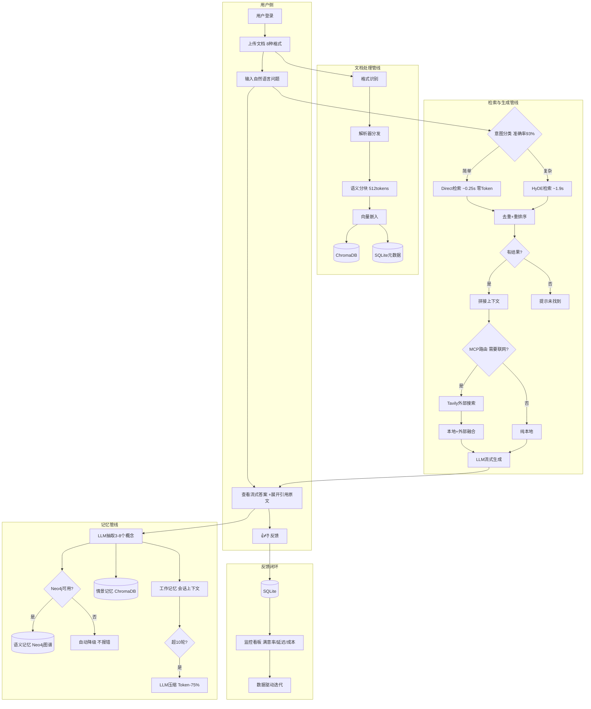
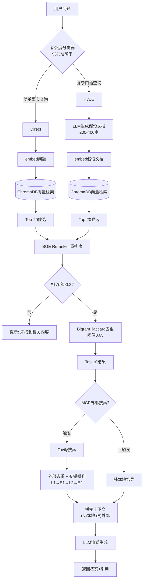
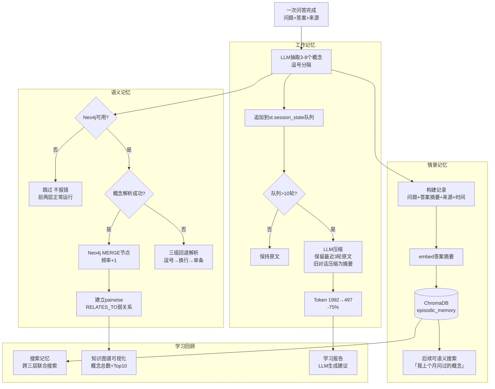
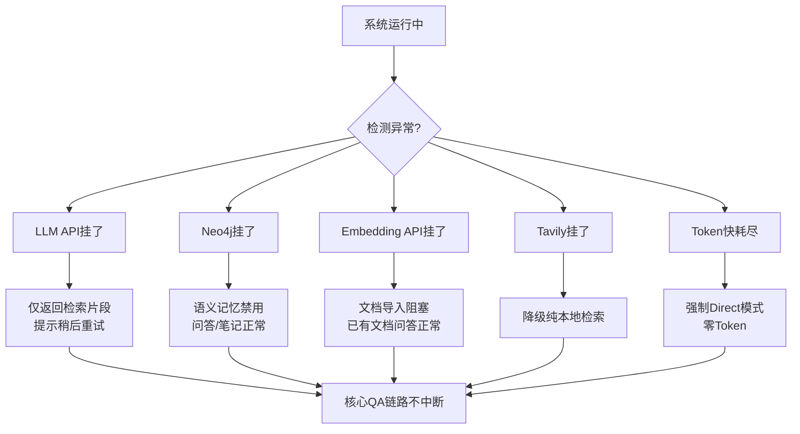
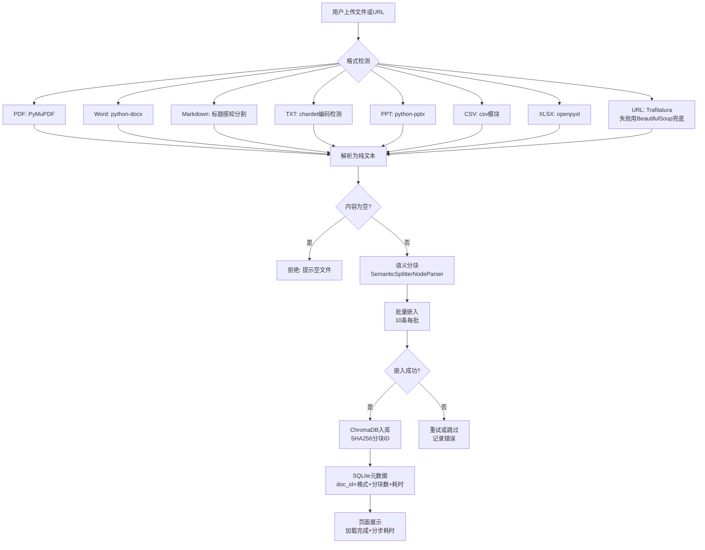

# DocMind 系统流程图

> 查看方式：复制代码块到 **https://mermaid.live** → 实时预览 + 导出 PNG/SVG
> 或者推送到 GitHub → 仓库页面自动渲染

---

## 1. 系统整体流程



---

## 2. 检索策略决策流程



---

## 3. 三记忆认知模型流程



---

## 4. 数据驱动迭代闭环

```mermaid
flowchart LR
    subgraph 线上运行
        A[用户提问] --> B[系统回答]
        B --> C[用户👍👎]
        C --> D[(SQLite feedback)]
        D --> E[监控看板<br/>满意率+延迟+Token]
    end
    
    subgraph 离线评测
        E --> F[收集Bad Case<br/>口语命中低/跑偏/遗忘]
        F --> G[生成评测数据集<br/>LLM生成+改写措辞+扩展GT]
        G --> H[跑Benchmark<br/>4方法×9指标+RAGAS]
        H --> I[输出对比报告<br/>定位根因]
    end
    
    subgraph 迭代决策
        I --> J{改进方向?}
        J -- 分块问题 --> K[语义分块<br/>R@10 +14.4pp]
        J -- 精度不够 --> L[加重排序<br/>MRR +29%]
        J -- 成本过高 --> M[动态路由<br/>Token -53%]
        J -- 策略选型 --> N[淘汰MQE<br/>选HyDE为主策略]
        K --> O[重新上线]
        L --> O
        M --> O
        N --> O
    end
    
    O --> A
    
    I --> P[9轮迭代结果<br/>MRR 0.42→0.75<br/>+79%]
```

---

## 5. 异常降级路径总览



---

## 6. 文档导入处理流程


